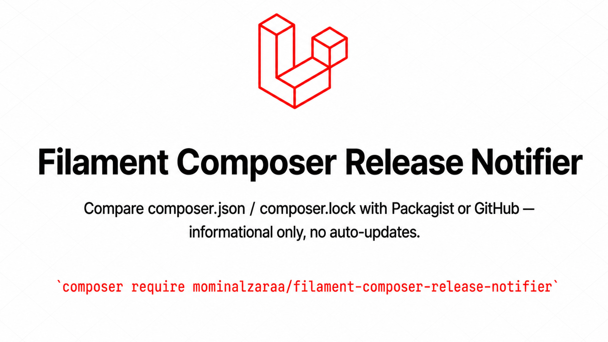
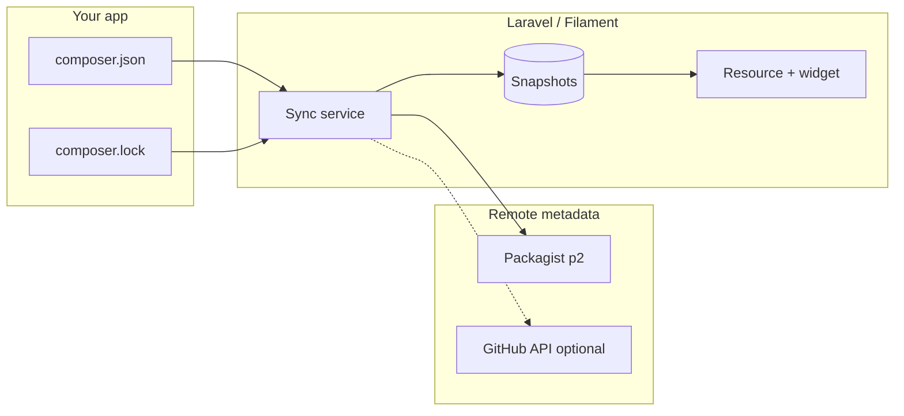

# Filament Composer Release Notifier

[](https://packagist.org/packages/mominalzaraa/filament-composer-release-notifier)
[](https://packagist.org/packages/mominalzaraa/filament-composer-release-notifier)
[](https://packagist.org/packages/mominalzaraa/filament-composer-release-notifier)
[](https://github.com/MominAlZaraa/filament-composer-release-notifier/actions/workflows/run-tests.yml)
[](https://github.com/MominAlZaraa/filament-composer-release-notifier/blob/main/LICENSE)
[](https://packagist.org/packages/mominalzaraa/filament-composer-release-notifier)
[](https://filamentphp.com)
[](https://github.com/MominAlZaraa/filament-composer-release-notifier)
[](https://github.com/sponsors/MominAlZaraa)

<p align="center">
  
</p>

<p align="center"><sub>Repository-relative banner (same pattern as <a href="https://github.com/MominAlZaraa/filament-localization/blob/main/README.md">Filament Localization</a>). A hidden duplicate URL satisfies the <a href="https://github.com/filamentphp/filamentphp.com/blob/main/PLUGIN_REVIEW_GUIDELINES.md">Filament plugin README + hero image</a> guideline when your listing uses the same artwork.</sub></p>

<!-- Same artwork URL as the Filament plugin directory hero: hidden on GitHub (hidden + 0-size) but keeps the duplicate URL for filamentphp.com review tooling / class="filament-hidden". -->


**Filament-native Composer visibility** — keep your team informed about **newer versions** of the packages declared in `composer.json` and pinned in `composer.lock`, without ever running `composer update` from the panel.

| | |
| :--- | :--- |
| **Default source** | [Packagist](https://packagist.org) `p2` metadata — **no GitHub token** required for version checks |
| **Optional** | GitHub Releases + compare API, commit summaries, HTML mail |
| **Surface** | Filament **resource**, **dashboard widget**, optional **email** digest |
| **Stance** | **Informational only** — bumps belong in **development** (CI, review), then deploy |

**Requirements**: PHP ^8.3 · Laravel ^12.0 \| ^13.0 · Filament ^5.0

> **Heads-up:** This plugin **observes** drift; it does **not** install updates, rewrite `composer.lock`, or execute Composer against production.

---

## Table of contents

- [Why this exists](#why-this-exists)
- [Features](#features)
- [Screenshots](#screenshots)
- [How it works](#how-it-works)
- [Installation](#installation)
- [Configuration highlights](#configuration-highlights)
- [Version source: Packagist vs GitHub](#version-source-packagist-vs-github)
- [Queue and sync](#queue-and-sync)
- [Filament and Tailwind v4](#filament-and-tailwind-v4)
- [Listing on the Filament plugin directory](#listing-on-the-filament-plugin-directory)
- [Testing](#testing)
- [Local development](#local-development)
- [Privacy](#privacy)
- [Contributing](#contributing)
- [Support & funding](#support--funding)
- [License](#license)

---

## Why this exists

One of the **first Filament-focused** tools aimed at **continuously checking** whether your Composer dependencies are **behind** published releases — **inside the panel** your team already uses.

- **Active comparison** after login (queued) plus **manual “Check again”** on the resource.
- **Informational only** — no `composer update`, no lockfile writes, no package installs from Filament.
- **Production stays read-only** for dependency changes; run updates in **dev**, test, merge, deploy.

---

## Features

- **Packagist-first** — latest stable versions from public `repo.packagist.org` (`/p2/{vendor}/{package}.json`).
- **GitHub mode** — optional switch to GitHub Releases + compare API when you care about release notes/tags.
- **Filament resource** — sortable table: package, installed, latest, sync time, **Details** modal (notes, compare link, optional commit list).
- **Dashboard widget** — at-a-glance **tracked** vs **behind latest** with an informational footer.
- **Session-aware sync** — one queued refresh per login session; logout resets so the next login can sync again.
- **“Check again”** — runs the sync job **synchronously** for instant feedback (works even without a queue worker).
- **Optional email** — HTML summary when mail is configured (throttle + recipient modes).
- **Browser compare URLs** — public GitHub compare links without the API when using Packagist mode (no token for the website).

---

## Screenshots

<p align="center">

<br />
<sub><strong>Dashboard widget</strong> — tracked packages vs behind latest; footer reminds you it is informational (no auto-updates).</sub>
</p>

<p align="center">

<br />
<sub><strong>Composer Packages</strong> — resource table, status badges, search, pagination, and <strong>Check again</strong>.</sub>
</p>

---

## How it works



1. Read **root** `composer.json` + `composer.lock` (paths configurable).
2. For each tracked package, resolve **latest** version (**Packagist** by default, or **GitHub** if configured).
3. Compare with **installed** lock version → outdated flag, optional **compare** / **release notes** / **commits**.
4. **Upsert** rows in `composer_release_package_snapshots` and prune removed packages.
5. **Filament** reads the table — widget + resource; **mail** optionally sends a digest.

---

## Installation

```bash
composer require mominalzaraa/filament-composer-release-notifier
```

Publish and migrate:

```bash
php artisan vendor:publish --tag="filament-composer-release-notifier-migrations"
php artisan migrate
```

Publish config (optional):

```bash
php artisan vendor:publish --tag="filament-composer-release-notifier-config"
```

Register the plugin on your panel:

```php
use MominAlZaraa\FilamentComposerReleaseNotifier\FilamentComposerReleaseNotifierPlugin;

$panel->plugins([
    FilamentComposerReleaseNotifierPlugin::make()
        ->resource(enabled: true)
        ->widget(enabled: true)
        ->mailReports(enabled: true),
]);
```

---

## Configuration highlights

File: `config/filament-composer-release-notifier.php`

```php
return [
    'enabled' => env('FILAMENT_COMPOSER_RELEASE_NOTIFIER_ENABLED', true),

    'composer_json_path' => env('FILAMENT_COMPOSER_RELEASE_NOTIFIER_COMPOSER_JSON', base_path('composer.json')),
    'composer_lock_path' => env('FILAMENT_COMPOSER_RELEASE_NOTIFIER_COMPOSER_LOCK', base_path('composer.lock')),

    // packagist (default) | github
    'version_source' => env('FILAMENT_COMPOSER_RELEASE_NOTIFIER_VERSION_SOURCE', 'packagist'),

    'packagist' => [
        'base_url' => env('FILAMENT_COMPOSER_RELEASE_NOTIFIER_PACKAGIST_URL', 'https://repo.packagist.org'),
        'http_timeout' => (int) env('FILAMENT_COMPOSER_RELEASE_NOTIFIER_PACKAGIST_TIMEOUT', 15),
        'user_agent' => env('FILAMENT_COMPOSER_RELEASE_NOTIFIER_PACKAGIST_USER_AGENT', 'filament-composer-release-notifier'),
    ],

    'github' => [
        'token' => env('GITHUB_TOKEN'),
        'http_timeout' => (int) env('FILAMENT_COMPOSER_RELEASE_NOTIFIER_HTTP_TIMEOUT', 15),
    ],

    'compare' => [
        'max_commits_stored' => 50,
        'fetch_github_commits_with_packagist' => env(
            'FILAMENT_COMPOSER_RELEASE_NOTIFIER_PACKAGIST_FETCH_GITHUB_COMMITS',
            false
        ),
    ],

    'excluded_packages' => [
        // 'some-vendor/internal-metapackage',
    ],

    // mail: recipient_mode, specific_emails, send_when, throttle_hours, ...
];
```

---

## Version source: Packagist vs GitHub

| Mode | Best for | Token |
| :--- | :--- | :--- |
| **`packagist` (default)** | Semver tags on Packagist, fast public JSON | Not required for versions |
| **`github`** | Teams that standardize on **GitHub Releases** + compare API | Recommended for rate limits / private repos |

**Packagist mode details**

- Reads `https://repo.packagist.org/p2/{vendor}/{package}.json`.
- If `source.url` in the lock is `github.com`, a **browser** compare URL is built (no GitHub API for the link itself).
- Set `FILAMENT_COMPOSER_RELEASE_NOTIFIER_PACKAGIST_FETCH_GITHUB_COMMITS=true` if you also want **commit summaries** via GitHub’s compare API (still optional; anonymous limits without a token).

**GitHub mode**

- Uses `/releases/latest` + compare API — align with your release process if tags mirror Packagist.

---

## Queue and sync

| Trigger | Behavior |
| :--- | :--- |
| **Login** (Filament user) | Dispatches **one** `SyncComposerReleaseSnapshotsJob` per session (queue). |
| **Logout** | Clears session flag so the **next** login can enqueue again. |
| **Check again** (header action) | Runs sync **synchronously** — instant table refresh; works without a worker. |

For GitHub API-heavy setups, set `GITHUB_TOKEN` in `.env` and `github.token` in config.

---

## Filament and Tailwind v4

If views live under `vendor/mominalzaraa/filament-composer-release-notifier`, add Tailwind **@source** so modal utilities survive `npm run build`:

```css
@source '../../vendor/mominalzaraa/filament-composer-release-notifier/resources/views/**/*.blade.php';
```

---

## Listing on the Filament plugin directory

Plugins are managed from **[filamentphp.com/author](https://filamentphp.com/author)**. This repo includes:

- [.github/FILAMENT_SUBMISSION_GUIDE.md](.github/FILAMENT_SUBMISSION_GUIDE.md) — checklist and official guideline links  
- [.github/PLUGIN_INFO.json](.github/PLUGIN_INFO.json) — copy-paste fields for the hub  
- [.github/BANNER_GUIDE.md](.github/BANNER_GUIDE.md) — banner dimensions (16:9, ≥2560×1440 JPEG)  
- [.github/AUTHOR.md](.github/AUTHOR.md) — author bio for listings  

Official expectations: [Plugin review guidelines](https://github.com/filamentphp/filamentphp.com/blob/main/PLUGIN_REVIEW_GUIDELINES.md).

---

## Testing

```bash
composer test
```

Host app with Pest already installed:

```bash
./vendor/bin/pest /path/to/filament-composer-release-notifier/tests/Unit
```

Feature tests should run from the **package root** so `tests/Pest.php` applies.

---

## Local development

`composer install` may hit GitHub rate limits on dist downloads. Configure OAuth once:

```bash
composer config --global github-oauth.github.com YOUR_GITHUB_TOKEN
```

CI uses `secrets.GITHUB_TOKEN` via `COMPOSER_AUTH` — see [.github/workflows/run-tests.yml](.github/workflows/run-tests.yml).

---

## Privacy

Sync uses **package names** and **public** metadata (Packagist and optionally GitHub). It does **not** upload your application source code.

---

## Contributing

Contributions are welcome — **issues** and **pull requests** on [GitHub](https://github.com/MominAlZaraa/filament-composer-release-notifier).

---

## Support & funding

If this package saves you time:

- **Star** the [repository](https://github.com/MominAlZaraa/filament-composer-release-notifier)  
- **Report bugs** / request features via [Issues](https://github.com/MominAlZaraa/filament-composer-release-notifier/issues)  
- **Sponsor** on [GitHub Sponsors](https://github.com/sponsors/MominAlZaraa)  
- **Email**: [support@mominpert.com](mailto:support@mominpert.com)  
- **Website**: [mominpert.com](https://mominpert.com)  

---

## License

MIT. See [LICENSE](LICENSE).
